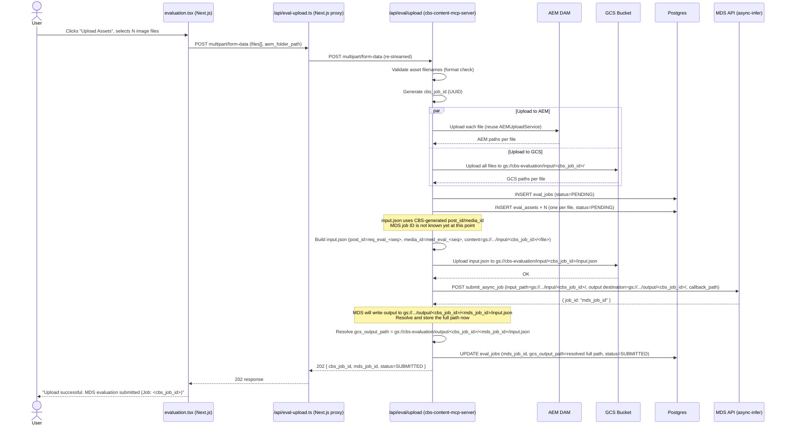
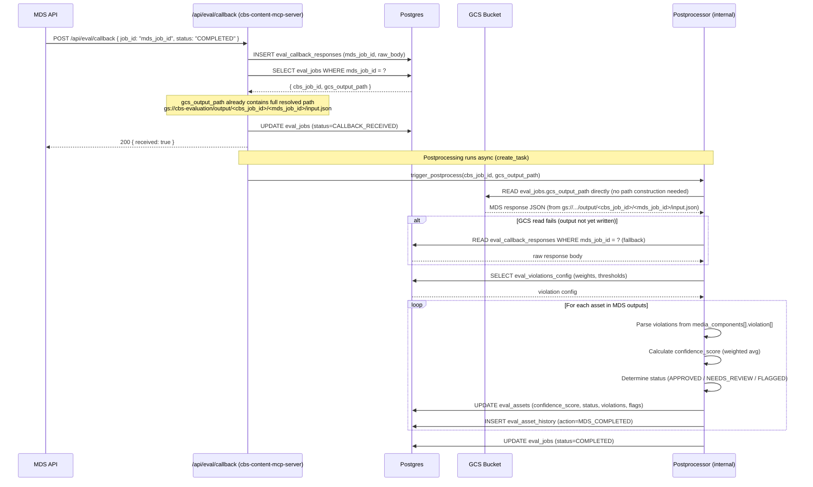
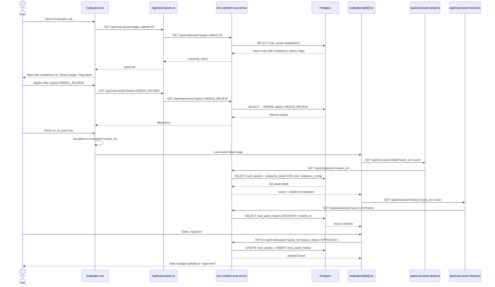

# MDS Evaluation - Implementation Plan
> **Scope**: CBS Playground → Evaluation Tab  
> **Backend**: `cbs-content-mcp-server` (Python / FastMCP / FastAPI)  
> **Frontend**: `creative-brand-system-cbs` (Next.js)  
> **Constraint**: REST APIs only — MCP JSON-RPC excluded for file upload (base64 encoding is impractical for large image sets)

---

## Current State vs Target State

| Area | Current State | Target State |
|---|---|---|
| **List View data source** | AEM folder (hardcoded path in `list-evaluation-assets.ts`) | Postgres `eval_assets` table |
| **Upload target** | AEM only (base64 → MCP JSON-RPC) | AEM + GCS (multipart/form-data → REST) |
| **MDS submission** | Not implemented | Auto-triggered after upload |
| **MDS response** | Not stored | Postgres callback table + GCS output read |
| **Confidence/Status/Flagged** | Hardcoded `--` | Calculated from MDS violations + weightage table |
| **Approve/Reject/Feedback** | Not implemented | Postgres-backed review workflow |
| **GCS service** | Exists — CSV/Excel only | Extend for binary image uploads |
| **Database URL** | Secret loaded in `server.py` | Connect Postgres repositories (new) |

---

## Architecture Overview

```
┌─────────────────────────────────────────────────────────────────┐
│                  creative-brand-system-cbs (Next.js)            │
│  evaluation.tsx  ──►  /api/eval-*  (Next.js proxy routes)      │
└────────────────────────────┬────────────────────────────────────┘
                             │ REST (multipart or JSON)
┌────────────────────────────▼────────────────────────────────────┐
│              cbs-content-mcp-server  (FastAPI REST)             │
│                                                                 │
│  ┌─────────────┐  ┌──────────────┐  ┌─────────────────────┐   │
│  │  Upload     │  │ MDS Job      │  │  Asset Query Layer  │   │
│  │  Handler    │  │ Submitter    │  │  (Postgres reads)   │   │
│  └──────┬──────┘  └──────┬───────┘  └─────────────────────┘   │
│         │                │                                      │
│  ┌──────▼──────┐  ┌──────▼───────┐  ┌─────────────────────┐   │
│  │ AEM Upload  │  │ Callback     │  │  Review / Workflow  │   │
│  │ GCS Upload  │  │ Receiver     │  │  (Approve/Reject)   │   │
│  │ Postgres    │  └──────┬───────┘  └─────────────────────┘   │
│  └─────────────┘         │                                      │
│                   ┌──────▼───────┐                              │
│                   │ Postprocessor│                              │
│                   │ (score calc) │                              │
│                   └──────────────┘                              │
└─────────────────────────────────────────────────────────────────┘
         │              │                     │
    ┌────▼───┐    ┌─────▼────┐        ┌──────▼──────┐
    │  AEM   │    │   GCS    │        │  Postgres   │
    │  DAM   │    │  Bucket  │        │   (eval_*)  │
    └────────┘    └──────────┘        └─────────────┘
                       │
               ┌───────▼───────┐
               │  MDS API      │
               │ (async-infer) │
               └───────────────┘
```

---

## Functional Blocks

### Block 1 — Upload Handler
**Responsibility**: Accept `multipart/form-data` from the UI, fan-out to all storage targets, and initiate job tracking.

- Accepts up to 100 image files in a single POST (`multipart/form-data`)
- Validates asset filename format: `<projectId>-<DID>-<publisherId>-<platform>-<date>-<assetType>-<size>-<assetName>.<ext>`
- Rejects files that do not conform (returns error list per file)
- Fans out in parallel:
  1. Upload each file to AEM (reuses existing `AEMUploadService`)
  2. Upload all files to a new timestamped GCS directory under `gs://cbs-evaluation/input/<cbs_job_id>/`
- Creates a `eval_jobs` record in Postgres with `status = PENDING`
- Creates one `eval_assets` record per file
- Delegates to **Block 2** to build `input.json` and submit to MDS

---

### Block 2 — MDS Job Submitter
**Responsibility**: Build `input.json` from upload metadata and call the MDS async inference API.

> **Important**: The MDS job ID does not exist yet when `input.json` is constructed. It is returned by the MDS API after submission. The `post_id` and `media_id` fields in `input.json` are CBS-generated sequence identifiers, independent of the MDS job ID.

- Constructs `input.json` per the MDS schema (see sample in `EvaluationPlan.txt`), mapping:
  - `post_id` → `req_eval_<cbs_job_id_short>_<sequence>` (CBS-generated, no MDS job ID needed)
  - `media_id` → `med_eval_<cbs_job_id_short>_<sequence>` (CBS-generated)
  - `content` → `gs://cbs-evaluation/input/<cbs_job_id>/<filename>`
- Uploads `input.json` to GCS: `gs://cbs-evaluation/input/<cbs_job_id>/input.json`
- Calls MDS `submit_async_job` with:
  - `input_path = gs://cbs-evaluation/input/<cbs_job_id>/`
  - `output_config.destination_folder_path = gs://cbs-evaluation/output/<cbs_job_id>/`
  - `callback_config.callback_path = https://.../api/eval/callback`
- Receives `mds_job_id` from MDS API response
- **Resolves full GCS output path**: `gs://cbs-evaluation/output/<cbs_job_id>/<mds_job_id>/input.json`
  - MDS always writes its output inside a subdirectory named after its own job ID within the `destination_folder_path` we provided
- Updates `eval_jobs`: `mds_job_id`, `gcs_output_path` (full resolved path), `status = SUBMITTED`

> **CBS↔MDS ID Sync Strategy**: The CBS job ID anchors the GCS output *base* folder (`output/<cbs_job_id>/`). Once MDS confirms its job ID, the full output path is immediately resolved and stored in `eval_jobs.gcs_output_path`. This gives two lookup directions at all times:
> - CBS → MDS: `eval_jobs WHERE cbs_job_id = ?` → read `mds_job_id`
> - MDS → CBS: `eval_jobs WHERE mds_job_id = ?` → read `cbs_job_id` + `gcs_output_path`
> 
> The postprocessor never needs to reconstruct paths — it always reads `gcs_output_path` directly from the DB.

---

### Block 3 — Callback Receiver
**Responsibility**: Receive MDS job completion webhooks and persist raw response.

- Public POST endpoint (no auth requirement from MDS side — validate via shared secret header if available)
- Writes raw `request body` → `eval_callback_responses` table keyed by `mds_job_id`
- Resolves `cbs_job_id` from `mds_job_id` via `eval_jobs` table
- Updates `eval_jobs.status = CALLBACK_RECEIVED`
- Triggers **Block 4** (Postprocessor) asynchronously (`asyncio.create_task`)

---

### Block 4 — Postprocessor
**Responsibility**: Read MDS output from GCS (or from the callback response in Postgres), compute weighted confidence scores, and update asset records.

- **Primary source**: Reads `eval_jobs.gcs_output_path` from DB — this is the fully resolved path `gs://cbs-evaluation/output/<cbs_job_id>/<mds_job_id>/input.json`, stored at submission time once MDS returned the job ID
- **Fallback source**: If GCS read fails (e.g. output not yet written), falls back to `eval_callback_responses` table (raw payload stored by Block 3)
- Parses `outputs[].media[].media_components[].violation[]` per asset
- Loads violation weights from `eval_violations_config` table
- Computes per-asset `confidence_score`:
  ```
  weighted_score = Σ (violation.score × violation.weight) for each violation
  normalized_confidence = 1 - (weighted_score / max_possible_weight)
  ```
- Determines `status`:
  - `APPROVED` if no severe violations and confidence ≥ threshold
  - `NEEDS_REVIEW` if confidence between low and high threshold
  - `FLAGGED` if any `is_severe = true` violation triggered
- Writes to `eval_assets`: `confidence_score`, `status`, `violations` (JSONB), `flags`
- Writes to `eval_asset_history`: one audit record per asset update
- Updates `eval_jobs.status = COMPLETED`

> **Cron fallback**: A periodic cron endpoint can scan for jobs stuck in `SUBMITTED` state and trigger postprocessing by reading GCS output directly.

---

### Block 5 — Asset Query Layer
**Responsibility**: Serve list, search, filter, and detail queries from Postgres.

- List with server-side pagination (`page`, `limit`)
- Filters: `status`, `confidence_min/max`, `flagged` (bool), `project_id`, `did`
- Full-text search on `asset_name`
- Detail: full asset record + parsed violations breakdown
- History: ordered log of all status changes and feedback events

---

### Block 6 — Review & Workflow
**Responsibility**: Handle approve, reject, and feedback operations, maintaining full audit trail.

- Status changes write to both `eval_assets.status` and `eval_asset_history`
- Feedback stored in `eval_feedback` with freetext notes
- No user role enforcement in Phase 1 (per plan) — `performed_by` stored as string

---

## Database Schema

### Table: `eval_jobs`
| Column | Type | Notes |
|---|---|---|
| `cbs_job_id` | `UUID` PK | Generated on upload |
| `mds_job_id` | `VARCHAR` | Returned by MDS API |
| `status` | `ENUM` | `PENDING`, `SUBMITTED`, `CALLBACK_RECEIVED`, `PROCESSING`, `COMPLETED`, `FAILED` |
| `aem_folder_path` | `TEXT` | AEM DAM folder where assets were uploaded |
| `gcs_input_path` | `TEXT` | `gs://cbs-evaluation/input/<cbs_job_id>/` |
| `gcs_output_base_path` | `TEXT` | `gs://cbs-evaluation/output/<cbs_job_id>/` — set at upload time, passed to MDS as `destination_folder_path` |
| `gcs_output_path` | `TEXT` | `gs://cbs-evaluation/output/<cbs_job_id>/<mds_job_id>/input.json` — set after MDS returns its job ID; MDS creates this subdirectory itself |
| `input_json_gcs_path` | `TEXT` | Full GCS path to `input.json` |
| `asset_count` | `INT` | Number of assets in this job |
| `created_at` | `TIMESTAMP` | |
| `updated_at` | `TIMESTAMP` | |

---

### Table: `eval_assets`
| Column | Type | Notes |
|---|---|---|
| `asset_id` | `UUID` PK | |
| `cbs_job_id` | `UUID` FK → `eval_jobs` | |
| `mds_post_id` | `VARCHAR` | `req_eval_<ts>_<seq>` used in `input.json` |
| `mds_media_id` | `VARCHAR` | `med_eval_<ts>_<seq>` |
| `asset_name` | `TEXT` | Full filename from upload |
| `project_id` | `VARCHAR` | Parsed from asset name (position 0) |
| `did` | `VARCHAR` | Parsed from asset name (position 1) |
| `publisher_id` | `VARCHAR` | Parsed from asset name (position 2) |
| `platform` | `VARCHAR` | Parsed from asset name (position 3) |
| `aem_path` | `TEXT` | Full AEM DAM path |
| `gcs_input_path` | `TEXT` | Full GCS path `gs://.../<filename>` |
| `status` | `ENUM` | `PENDING`, `PROCESSING`, `APPROVED`, `NEEDS_REVIEW`, `FLAGGED`, `REJECTED` |
| `confidence_score` | `FLOAT` | 0.0 – 1.0 |
| `violations` | `JSONB` | Full parsed violation list from MDS |
| `flags` | `JSONB` | Severe violation names that triggered flag |
| `walmart_affiliation` | `BOOLEAN` | From MDS `post_moderation_result.walmart_affiliation` |
| `is_ftc_compliant` | `BOOLEAN` | From MDS |
| `assigned_to` | `TEXT` | Optional |
| `created_at` | `TIMESTAMP` | |
| `updated_at` | `TIMESTAMP` | |

---

### Table: `eval_callback_responses`
| Column | Type | Notes |
|---|---|---|
| `id` | `UUID` PK | |
| `mds_job_id` | `VARCHAR` | Indexed |
| `response_body` | `JSONB` | Full raw MDS callback payload |
| `received_at` | `TIMESTAMP` | |

---

### Table: `eval_violations_config`
| Column | Type | Notes |
|---|---|---|
| `violation_code` | `VARCHAR` PK | e.g. `"68"`, or name-based key |
| `violation_name` | `TEXT` | e.g. `"color-contrast"` |
| `weight` | `FLOAT` | Scoring weight (from Lise) |
| `is_severe` | `BOOLEAN` | Triggers `FLAGGED` status |
| `threshold_postflag_count` | `INT` | |
| `threshold_publisherflag_count` | `INT` | |
| `severity` | `INT` | |
| `wm_affiliation_factor` | `FLOAT` | |
| `description` | `TEXT` | |

> **Note**: Weights and thresholds are an action item from Lise. Table can be seeded with defaults and updated via admin API or direct DB insert.

---

### Table: `eval_asset_history`
| Column | Type | Notes |
|---|---|---|
| `id` | `UUID` PK | |
| `asset_id` | `UUID` FK → `eval_assets` | |
| `action` | `VARCHAR` | `UPLOADED`, `MDS_SUBMITTED`, `MDS_COMPLETED`, `STATUS_CHANGED`, `FEEDBACK_ADDED` |
| `performed_by` | `TEXT` | User identifier (Phase 1: any string) |
| `old_value` | `JSONB` | Previous state snapshot |
| `new_value` | `JSONB` | New state snapshot |
| `notes` | `TEXT` | Optional human notes |
| `created_at` | `TIMESTAMP` | |

---

### Table: `eval_feedback`
| Column | Type | Notes |
|---|---|---|
| `id` | `UUID` PK | |
| `asset_id` | `UUID` FK → `eval_assets` | |
| `feedback_text` | `TEXT` | |
| `submitted_by` | `TEXT` | |
| `created_at` | `TIMESTAMP` | |

---

## API Specification (cbs-content-mcp-server — REST Only)

All new endpoints live under the `/api/eval/` prefix in `api_controller.py`.

---

### Upload & Job Management

#### `POST /api/eval/upload`
Upload assets — fan-out to AEM, GCS, Postgres, and trigger MDS.

- **Content-Type**: `multipart/form-data`
- **Form fields**:
  - `files[]` — one or more image files (max 100, validated name format)
  - `aem_folder_path` (string) — destination AEM DAM folder
- **Response** `202 Accepted`:
```json
{
  "cbs_job_id": "uuid",
  "status": "SUBMITTED",
  "asset_count": 6,
  "gcs_input_path": "gs://cbs-evaluation/input/<cbs_job_id>/",
  "mds_job_id": "d6542ffc_e94a_44dd_a62e_f437146b9429",
  "aem_folder_path": "/content/dam/...",
  "validation_errors": []
}
```
- **Error cases**: files with invalid naming return per-file errors in `validation_errors` without blocking valid files

---

#### `GET /api/eval/jobs/{cbs_job_id}`
Poll job status.

- **Response**:
```json
{
  "cbs_job_id": "uuid",
  "mds_job_id": "...",
  "status": "PROCESSING",
  "asset_count": 6,
  "completed_count": 4,
  "created_at": "...",
  "updated_at": "..."
}
```

---

#### `POST /api/eval/callback`
MDS webhook — receives job completion signal.

- **Content-Type**: `application/json`
- **Body**: Raw MDS callback payload (job status + job_id)
- **Response** `200 OK`: `{ "received": true }`
- Stores raw body to `eval_callback_responses`, triggers postprocessing async
- **Note**: Registered as `callback_path` in MDS job submission

---

#### `POST /api/eval/jobs/{cbs_job_id}/postprocess`
Manually trigger postprocessing (for cron job or manual retry).

- No body required
- Re-reads GCS output and recalculates scores
- **Response**: job status after processing

---

### Asset Operations

#### `GET /api/eval/assets`
List assets with filters and pagination.

- **Query params**:
  - `project_id`, `did` (string filters)
  - `status` (`APPROVED` | `NEEDS_REVIEW` | `FLAGGED` | `REJECTED` | `PENDING`)
  - `flagged` (`true` | `false`)
  - `confidence_min`, `confidence_max` (float 0.0–1.0)
  - `search` (substring match on `asset_name`)
  - `page` (default: 1), `limit` (default: 25, max: 100)
  - `sort_by` (`created_at` | `confidence_score` | `status`), `sort_order` (`asc` | `desc`)
- **Response**:
```json
{
  "assets": [
    {
      "asset_id": "uuid",
      "asset_name": "7502741-5417-NULL-PMAX-...",
      "project_id": "7502741",
      "did": "5417",
      "status": "NEEDS_REVIEW",
      "confidence_score": 0.73,
      "flags": ["color-contrast", "spelling"],
      "walmart_affiliation": false,
      "assigned_to": null,
      "aem_path": "/content/dam/...",
      "created_at": "..."
    }
  ],
  "total": 42,
  "page": 1,
  "limit": 25
}
```

---

#### `GET /api/eval/assets/{asset_id}`
Full asset detail including violation breakdown.

- **Response**: Full `eval_assets` record plus:
  - `violations_detail`: list of violations with name, score, weight, is_severe
  - `job`: parent job summary
  - `latest_feedback`: most recent feedback entry

---

#### `PATCH /api/eval/assets/{asset_id}/status`
Approve or reject an asset.

- **Body**:
```json
{
  "status": "APPROVED",
  "performed_by": "user@walmart.com",
  "notes": "Looks good after manual review"
}
```
- Writes history record, updates `eval_assets.status`
- **Response**: updated asset record

---

#### `POST /api/eval/assets/{asset_id}/feedback`
Submit feedback on an asset.

- **Body**:
```json
{
  "feedback_text": "Color logo violation is a false positive here",
  "submitted_by": "user@walmart.com"
}
```
- Writes to `eval_feedback` and `eval_asset_history`
- **Response**: `{ "feedback_id": "uuid", "created_at": "..." }`

---

#### `GET /api/eval/assets/{asset_id}/history`
Full audit trail for an asset.

- **Response**:
```json
{
  "asset_id": "uuid",
  "history": [
    {
      "action": "UPLOADED",
      "performed_by": "system",
      "new_value": { "aem_path": "...", "gcs_path": "..." },
      "created_at": "..."
    },
    {
      "action": "MDS_COMPLETED",
      "new_value": { "confidence_score": 0.73, "status": "NEEDS_REVIEW" },
      "created_at": "..."
    },
    {
      "action": "STATUS_CHANGED",
      "performed_by": "user@walmart.com",
      "old_value": { "status": "NEEDS_REVIEW" },
      "new_value": { "status": "APPROVED" },
      "notes": "Looks good after manual review",
      "created_at": "..."
    }
  ]
}
```

---

### Reference Data

#### `GET /api/eval/violations`
List all violation definitions with weights.

- **Response**: array of `eval_violations_config` records
- Used by UI to show violation labels and severity indicators

---

## Frontend Changes (creative-brand-system-cbs)

### New Next.js API Proxy Routes

| New File | Purpose |
|---|---|
| `/pages/api/eval-upload.ts` | Proxy multipart upload to `/api/eval/upload`. Uses `busboy` or `formidable` to handle `multipart/form-data` and re-streams to backend. Replaces `upload-assets.ts` base64 approach. |
| `/pages/api/eval-assets.ts` | Proxy `GET /api/eval/assets` with passthrough query params. Replaces `list-evaluation-assets.ts`. |
| `/pages/api/eval-asset-detail.ts` | Proxy `GET /api/eval/assets/{asset_id}` |
| `/pages/api/eval-asset-status.ts` | Proxy `PATCH /api/eval/assets/{asset_id}/status` |
| `/pages/api/eval-asset-feedback.ts` | Proxy `POST /api/eval/assets/{asset_id}/feedback` |
| `/pages/api/eval-asset-history.ts` | Proxy `GET /api/eval/assets/{asset_id}/history` |

### Page Changes

| File | Change |
|---|---|
| `evaluation.tsx` | Replace `list-evaluation-assets.ts` call → `eval-assets.ts`. Populate Confidence, Flagged, Status columns from Postgres data. Add filter/search query params. |
| `evaluation/[did].tsx` | Pass `asset_id` (Postgres UUID) in route/query. Load violation detail from `eval-asset-detail.ts`. Wire Approve/Reject buttons to `eval-asset-status.ts`. Wire Feedback tab to `eval-asset-feedback.ts`. Wire History tab to `eval-asset-history.ts`. |
| `components/Evaluation-tab/UploadDialog` | Switch from base64 JSON-RPC → `FormData` multipart POST to `eval-upload.ts`. Show per-file upload + MDS submission progress. |

---

## Sequence Diagrams

### 1. Upload & MDS Submission Flow



---

### 2. MDS Callback & Postprocessing Flow



---

### 3. UI List View & Detail View Flow



---

## Implementation Phases

### Phase 1 — Callback API + DB Setup (Step 1)
**Goal**: Store MDS responses in Postgres; prove the plumbing works before upload changes.

- Create `eval_callback_responses` and `eval_jobs` tables (Alembic migration)
- Create `EvalCallbackRepository` (Postgres)
- Implement `POST /api/eval/callback` endpoint
- Seed `eval_violations_config` table with known violation names (weights = 0 placeholder until Lise provides)
- Test: manually submit a job via MDS curl, confirm callback is stored

---

### Phase 2 — Upload (Step 2)
**Goal**: Replace base64 MCP approach with streaming multipart REST upload → AEM + GCS + DB + MDS.

- Extend `GCSUploadService` to support binary image uploads (reuse `_sync_upload_bytes`)
- Create `EvalUploadService` — orchestrates AEM + GCS + DB + MDS submission
- Create `EvalJobRepository` and `EvalAssetRepository` (Postgres)
- Implement `POST /api/eval/upload` endpoint
- Implement `GET /api/eval/jobs/{cbs_job_id}` endpoint
- Frontend: Replace `UploadDialog` to use `FormData` multipart POST, add job status polling

---

### Phase 3 — Postprocessing + Scoring (Step 3)
**Goal**: Close the loop from MDS response to scored asset records.

- Implement `EvalPostprocessorService`:
  - GCS output reader
  - Violation parser
  - Weighted confidence scorer
  - Status deriver
- Wire postprocessor into callback handler (async trigger)
- Implement `POST /api/eval/jobs/{cbs_job_id}/postprocess` (manual trigger / cron)
- Frontend: Populate Confidence %, Status badge, Flagged columns from Postgres data

---

### Phase 4 — Asset Management APIs + UI (Step 4)
**Goal**: Full list/filter/detail/approve/reject/feedback flows.

- Implement `GET /api/eval/assets` (with all filters)
- Implement `GET /api/eval/assets/{asset_id}`
- Implement `PATCH /api/eval/assets/{asset_id}/status`
- Implement `POST /api/eval/assets/{asset_id}/feedback`
- Implement `GET /api/eval/assets/{asset_id}/history`
- Implement `GET /api/eval/violations`
- Frontend: wire all detail tabs, approve/reject buttons, feedback form, history tab

---

## What's Already Built (Reuse)

| Component | Location | Reuse Plan |
|---|---|---|
| `AEMUploadService` | `services/aem_upload_service.py` | Reuse as-is in Phase 2 upload handler |
| `GCSUploadService` | `services/gcs_upload_service.py` | Extend `_sync_upload_bytes` for images in Phase 2 |
| `/api/aem-download-asset` | `api_controller.py` | Reuse unchanged for asset image preview in detail view |
| `DATABASE_URL` secret | `server.py` | Already loaded — just need Postgres repositories |
| MDS curl examples | `EvaluationPlan.txt` | Direct reference for `EvalJobSubmitterService` |
| `evaluation.tsx` list UI | `pages/evaluation.tsx` | Change data source only — UI structure stays |
| `evaluation/[did].tsx` detail UI | `pages/evaluation/[did].tsx` | Wire tabs to real API data — layout unchanged |
| Asset filename parser | (new, shared util) | Parse `projectId-DID-publisherId-platform-...` |

---

## Open Items / Dependencies

| Item | Owner | Blocker for |
|---|---|---|
| Violation weights + thresholds | Lise | Phase 3 scoring accuracy |
| GCS bucket name for evaluation (`cbs-evaluation`) | Infra | Phase 2 |
| MDS API credentials (WM_CONSUMER.ID, headers) | Platform team | Phase 2 |
| Max asset count per job (50 or 100) | Product decision | Phase 2 validation |
| User identity for approve/reject (Phase 1 = any string) | Product | Phase 4 |
